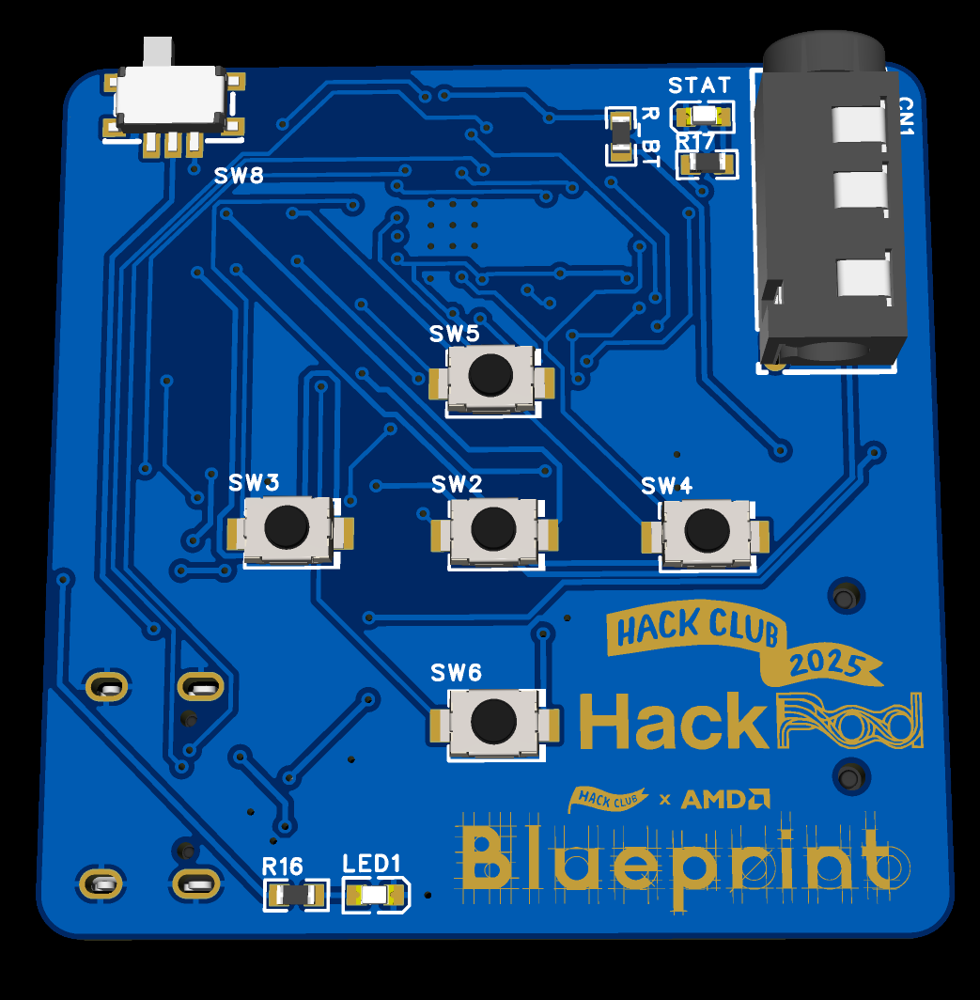
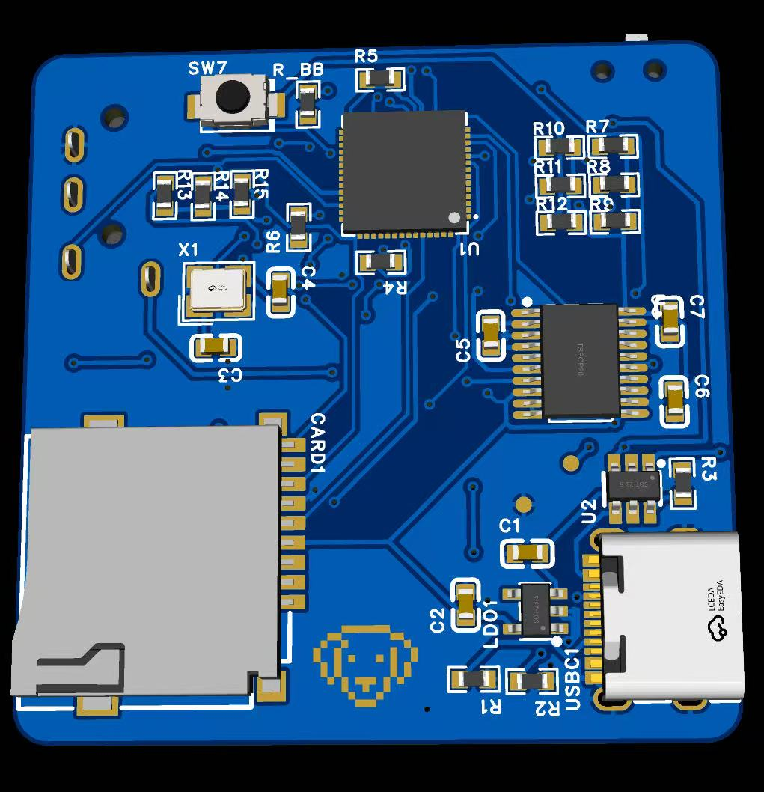
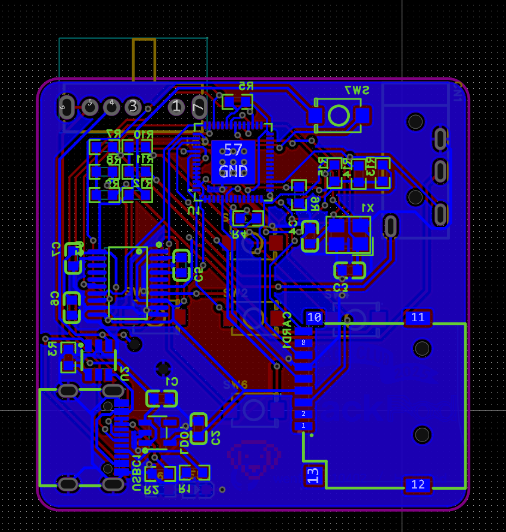
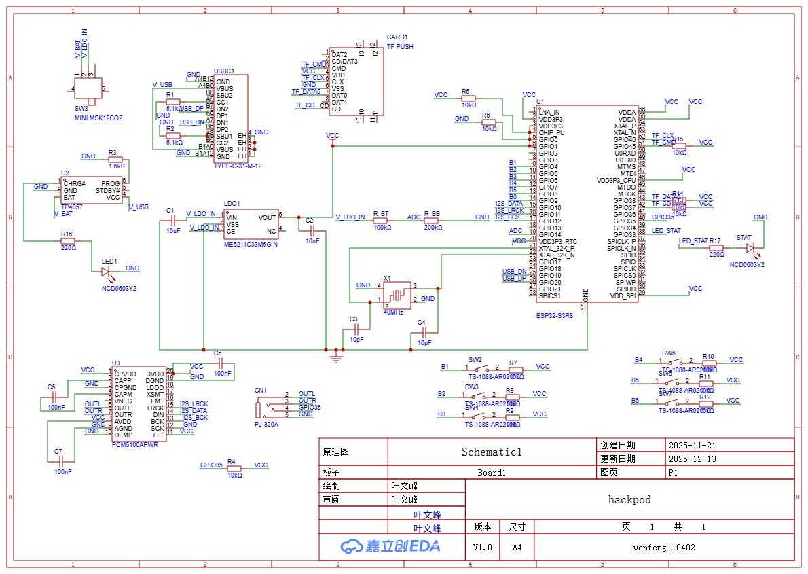

# HackPod

HackPod is my small MP3 player. It is inspired by iPod shuffle. I want a tiny music thing I can carry anywhere, so I made this. I am a middle school student. This project is for learning and for fun.

## Why I made it

- I like simple music players.
- iPod shuffle is cool and cute.
- I want to learn electronics and code.

## What it does

- Plays MP3 songs from a micro SD card.
- Buttons: Play/Pause, Next, Previous, Volume Up, Volume Down, and one extra "Hack" button.
- I2S audio to DAC/amp and a small speaker.
- LED status light.
- Battery check by ADC (shows high / medium / low).

## Parts I use

- ESP32 (microcontroller)
- Micro SD card slot
- 6 buttons
- Battery (lithium)
- Small amplifier + speaker
- My small PCB (see files in `PCB/`)

## Project files

- Firmware: `FIRMWARE/HackPod/`
- PCB files: `PCB/`
- 3D shell model: `3DSHELL/`

## Status

- Hardware works.
- Firmware is simple now. I will keep improving.

## Screenshots

